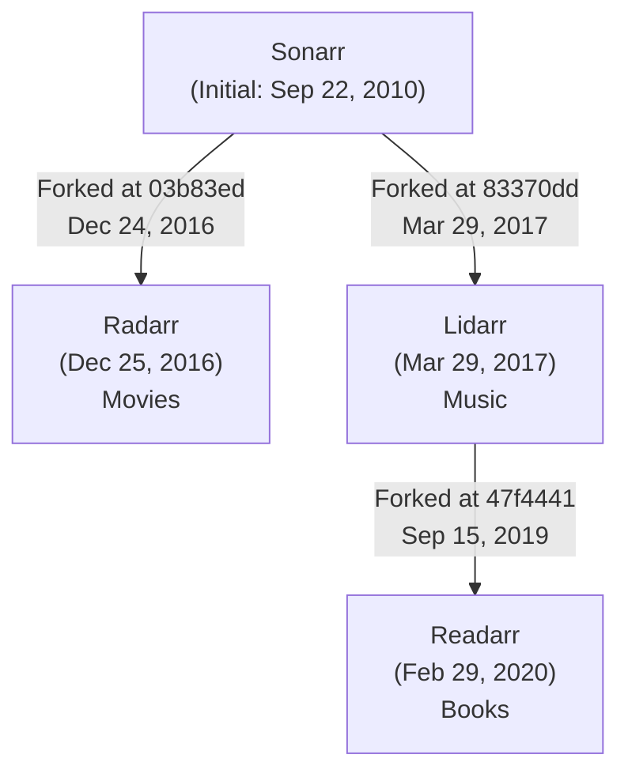

# *Arr Project History and Relationships

This document provides an overview of the lineage and relationships between the various *arr projects (Sonarr, Radarr, Lidarr, and Readarr).

## Fork History

Based on Git merge-base analysis, we've established the following historical relationships between the projects:

- **Sonarr** is the original project, with initial commit in September 2010.
- **Radarr** was forked from Sonarr in December 2016.
- **Lidarr** was forked from Sonarr in March 2017.
- **Readarr** was forked from Lidarr in February 2020.

## Fork Timeline

- **Sonarr**: Initial commit on September 22, 2010 by kay.one
- **Radarr**: Forked from Sonarr after commit `03b83ed226` (Dec 24, 2016 - "Rename Metadata Dir to fix build in *nix")
  - First Radarr-specific commit: Dec 25, 2016 by Leonardo Galli
- **Lidarr**: Forked from Sonarr after commit `83370ddbbb` (Mar 29, 2017 - "Episode files sent to Recycling Bin are put into subfolders")
  - First Lidarr-specific commit: Mar 29, 2017 by Matthew Despain ("First round of refactoring")
- **Readarr**: Forked from Lidarr after commit `47f4441c43` (Sep 15, 2019 - "Revert 7ffecf6 for ProcessProviderFixture")
  - First Readarr-specific commit: Feb 29, 2020 by Qstick ("New: Lidarr to Readarr")

## Fork Diagram

## Project Focuses

- **Sonarr**: TV Series management and automation
- **Radarr**: Movie management and automation
- **Lidarr**: Music album management and automation
- **Readarr**: Book management and automation

## Shared Architecture and Key Differences

All *arr projects share a common architectural foundation inherited from their ancestors:

1. **Backend Framework**: .NET-based application
2. **Frontend**: Initially AngularJS, with newer versions migrating to a more modern stack
3. **Database**: SQLite for data storage
4. **Common Features**:
   - Quality profiles and management
   - Release parsing and filtering
   - Automated media organization
   - NZB/Torrent integration
   - Notifications system
   - API for third-party integrations

The primary differences are in the specific media domain each handles:

| Project | Media Type | Metadata Sources | Indexers | Special Features |
|---------|------------|------------------|----------|------------------|
| Sonarr | TV Shows/Episodes | TheTVDB, TMDB | TV-focused | Season/episode handling |
| Radarr | Movies | TMDB, IMDB | Movie-focused | Collection support |
| Lidarr | Music/Albums | MusicBrainz | Music-focused | Artist/album structure |
| Readarr | Books/Audiobooks | Goodreads, Google Books | Book-focused | Author/book structure |

## Development Patterns

Each fork inherits the core architecture while adapting it to their specific media domain. Common patterns include:

1. Renaming key domain concepts (e.g., from Series to Movies, Artists, or Authors)
2. Adding media-type specific metadata handlers
3. Customizing search and import logic for the specific media type
4. Maintaining compatibility with the common infrastructure

The projects continue to share innovations, with features often being implemented in one project and then ported to the others.

## Community and Governance

The *arr family of projects has developed a collaborative ecosystem while maintaining independent governance:

1. **Independent Teams**: Each project is maintained by its own core development team
2. **Cross-Project Collaboration**: Developers often contribute across multiple *arr projects
3. **Shared Communication**: Common Discord server for user support across projects
4. **Infrastructure Sharing**: Similar deployment strategies, Docker images, and installation methods

This community structure allows each project to focus on its specific domain while benefiting from shared knowledge and resources. Innovations in one project often inspire or directly transfer to others, creating an ecosystem where improvements in one project can benefit the entire family.

## Cross-Project Adaptations

When examining the commit history after each fork, patterns emerge showing how each project adapted the codebase:

1. **Initial Adaptation**: Replacing domain terminology (Series → Movies/Artists/Books)
2. **Domain Logic**: Adding specialized handling for media-specific requirements
3. **UI Customization**: Modifying interfaces to support different media types
4. **Metadata Sources**: Integrating with domain-specific metadata providers

This pattern of adaptation while maintaining architectural compatibility has been key to the success of the *arr ecosystem.
