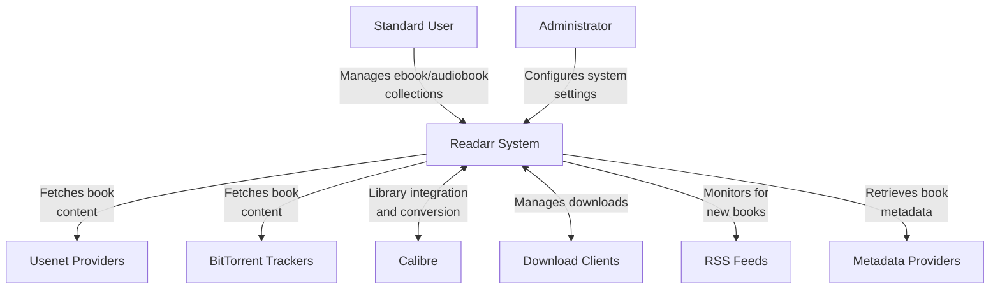

# System Context Diagram (C4 Model - Level 1)

## User Roles

- **Standard User** - The primary user who manages their ebook and audiobook collections
- **Administrator** - User with advanced system configuration capabilities

## External Systems

- **Usenet Providers** - Sources for downloading book content via Usenet
- **BitTorrent Trackers** - Sources for downloading book content via BitTorrent
- **Calibre** - Integration with Calibre library management system
- **Download Clients** - Integration with SABnzbd, NZBGet, QBittorrent, Deluge, rTorrent, Transmission, uTorrent, etc.
- **RSS Feeds** - Sources for monitoring new books
- **Metadata Providers** - Services that provide book metadata

## System Context Diagram

## Discussion

The Readarr system serves as a central hub for managing ebook and audiobook collections. Users interact with the system to organize their digital book libraries, while the system communicates with various external services to acquire content, manage downloads, and enhance the library with metadata.

Readarr is designed to automate the process of obtaining and organizing digital books, providing features such as automatic detection of new books, quality management, and integration with various download clients and library management systems. 