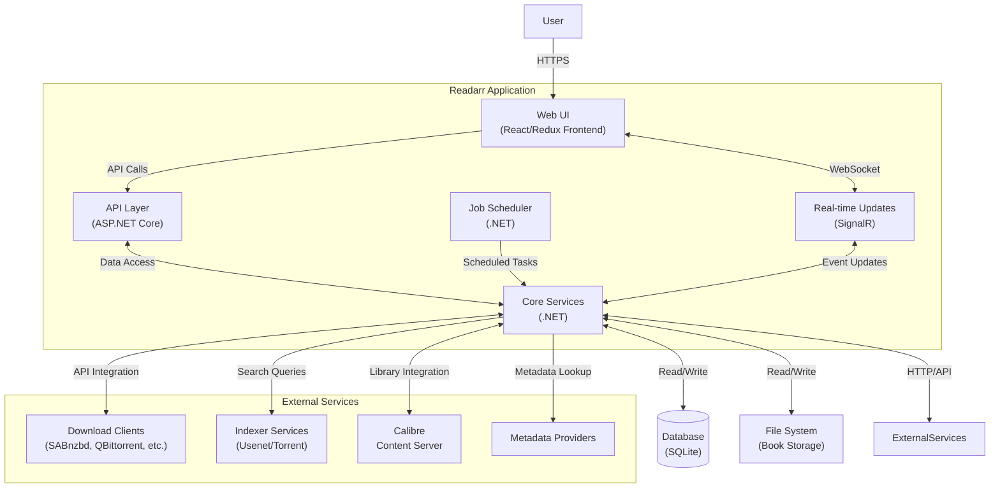

# Container Diagram (C4 Model - Level 2)

This diagram breaks down the Readarr application into its major deployable components (containers) and illustrates the communication pathways between them.

## Container Diagram

## Containers Description

### Core Components

**1. Web UI (Frontend)**
- React/Redux based single-page application
- Communicates with the backend through API calls
- Provides user interface for all application functionality
- Receives real-time updates via SignalR

**2. API Layer**
- ASP.NET Core REST API
- Handles HTTP requests from the Web UI
- Provides endpoints for all application operations
- Authenticates and authorizes user actions

**3. Core Services**
- Contains the core business logic of the application
- Manages authors, books, and library operations
- Coordinates with external services and data storage
- Implements quality detection, renaming rules, and metadata management

**4. Job Scheduler**
- Manages scheduled tasks such as RSS syncing and library scanning
- Handles background processing and maintenance operations
- Ensures recurring tasks are performed at appropriate intervals

**5. SignalR**
- Provides real-time updates to the UI
- Enables push notifications for long-running tasks
- Creates a WebSocket connection for bidirectional communication

### Data Storage

**1. Database (SQLite)**
- Stores application configuration
- Maintains metadata for authors and books
- Tracks download history, quality profiles, and system settings
- Default is SQLite, but supports other database engines

**2. File System**
- Stores the actual book files
- Organized according to user-defined naming schemas
- May span multiple locations/drives

### External Services

**1. Download Clients**
- External applications that handle the actual downloading
- Examples: SABnzbd, NZBGet, QBittorrent, Deluge, etc.
- Integrated through their respective APIs

**2. Indexer Services**
- Usenet indexers and BitTorrent trackers
- Provide search results for book content
- Sources for RSS feeds to monitor

**3. Calibre**
- Optional integration with Calibre Content Server
- Provides enhanced library management
- Handles book format conversion

**4. Metadata Providers**
- External services that provide book and author metadata
- Cover art, descriptions, release dates, etc.

## Communication Patterns

- The Web UI communicates with the backend through RESTful API calls
- Real-time updates flow through SignalR connections
- Scheduled jobs are executed by the Job Scheduler at configured intervals
- External services are integrated through HTTP APIs, typically with polling mechanisms
- The File System is accessed directly for reading and writing book files
- Database interactions follow repository patterns for data access 