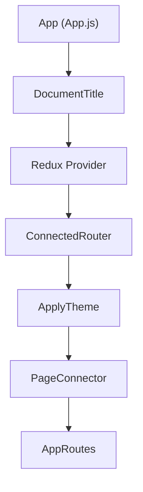
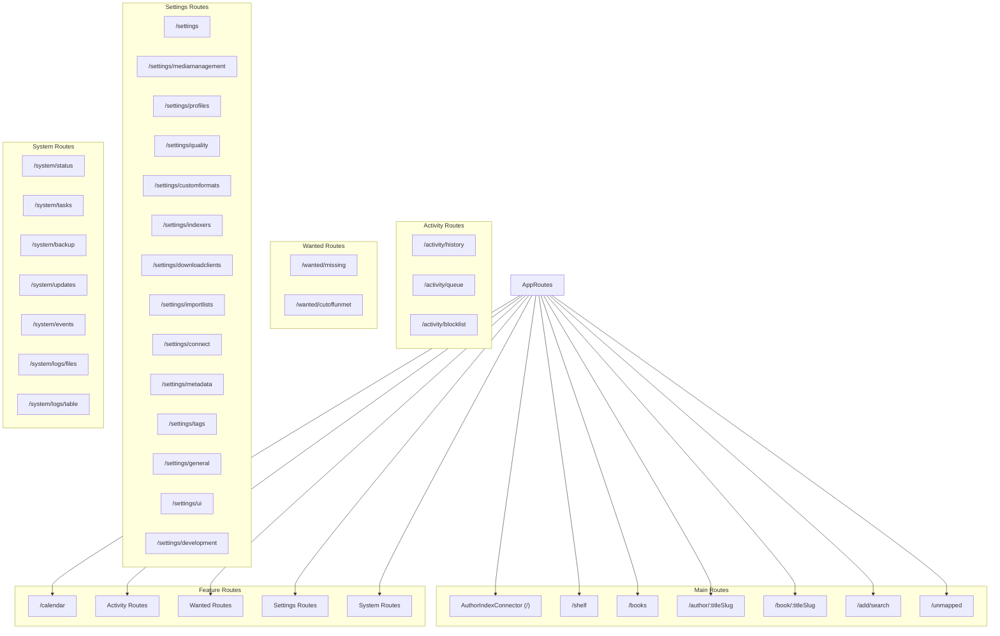

# Component Hierarchy

This document outlines the hierarchy of the main React components in Readarr's frontend application, detailing the structure and relationships between components.

## Application Root Structure

### App Root Components

**`App`**
- Props: 
  - `store`: Redux store (required)
  - `history`: Browser history object (required)
- Purpose: Root component that sets up the Redux provider, router, and theme

**`DocumentTitle`**
- Props: 
  - `title`: Window title string (Readarr instance name)
- Purpose: Sets the document title for the browser window

**`ApplyTheme`**
- Purpose: Applies the selected UI theme to the application

**`PageConnector`**
- Purpose: Connects page-level state and actions to the component tree

**`AppRoutes`**
- Props:
  - `app`: Reference to the App component
- Purpose: Defines all application routes and their corresponding components

## Primary Navigation Structure

## Major Component Descriptions

### Author Components

**`AuthorIndexConnector`**
- Props:
  - Various filtering and display options
- State:
  - List of authors
  - Selected filters
  - Sort options
- Purpose: Displays the main author list with filtering and sorting capabilities

**`AuthorDetailsPageConnector`**
- Props:
  - `titleSlug`: Author identifier from URL
- State:
  - Author details
  - Author's books
  - Author's history
- Purpose: Shows detailed information for a specific author and their books

### Book Components

**`BookIndexConnector`**
- Props:
  - Filtering and display options
- State:
  - List of books
  - Filter state
  - Sort options
- Purpose: Displays the complete book list with filtering and sorting options

**`BookDetailsPageConnector`**
- Props:
  - `titleSlug`: Book identifier from URL
- State:
  - Book details
  - Files
  - History
  - Available releases
- Purpose: Shows detailed information for a specific book

### Bookshelf Component

**`BookshelfConnector`**
- Props:
  - View options
- State:
  - Bookshelf data
  - View configuration
- Purpose: Provides a visual bookshelf-style view of the book collection

### Activity Components

**`HistoryConnector`**
- Purpose: Shows history of all download and import activities

**`QueueConnector`**
- Purpose: Displays current download queue with status and controls

**`BlocklistConnector`**
- Purpose: Shows blocked releases with reason for blocking

### Settings Components

**`Settings`**
- Purpose: Main settings navigation page

**`MediaManagementConnector`**
- Purpose: Configure media management settings like naming, file handling

**`ProfilesConnector`**
- Purpose: Manage quality and metadata profiles

**`QualityConnector`**
- Purpose: Configure quality definitions

**`IndexerSettingsConnector`**
- Purpose: Manage indexers for searching and RSS feeds

**`DownloadClientSettingsConnector`**
- Purpose: Configure download clients like SABnzbd, QBittorrent, etc.

## Reusable Components

### UI Components

**`Form`** components
- Input fields, checkboxes, dropdowns, etc.
- Form validation and submission handling

**`Table`** components
- Data display with sorting, pagination
- Row selection and actions

**`Modal`** components
- Dialog windows for confirmations, forms, and information
- Portal-based rendering for correct stacking context

**`Page`** components
- Page layouts, headers, and toolbars
- Loading and error states

### Feature Components

**`Filter`** components
- Input components for filtering data
- Filter presets and custom filter management

**`Link`** components
- Enhanced links with proper routing integration
- External and internal navigation handling

**`Loading`** components
- Loading indicators and spinners
- Placeholder content while data loads

**`Error`** components
- Error display and handling
- Retry mechanisms 