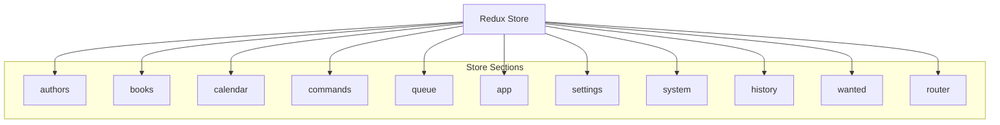
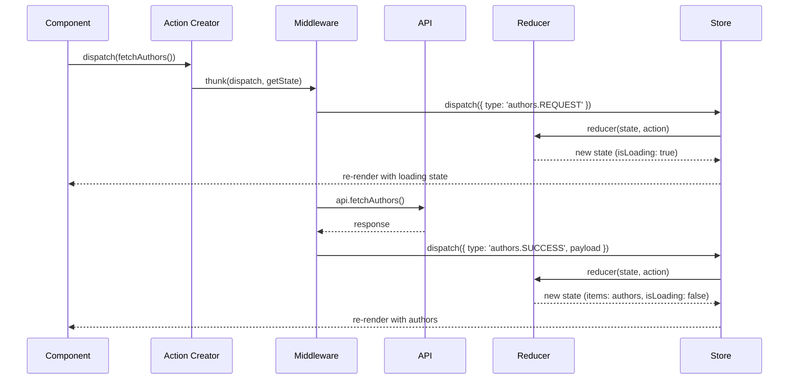

# State Management (Redux)

This document outlines the Redux state management architecture used in Readarr's frontend application, describing the store structure, actions, reducers, and data flow patterns.

## Redux Store Structure

Readarr uses a modular Redux store with different sections for different parts of the application. The store is created using the `createAppStore` function which configures Redux with the necessary middleware and reducers.



## Actions

Actions in Readarr are organized by feature area. Each action module typically exports:

1. Action types (constants)
2. Action creators (functions that return action objects)
3. Thunks (async actions that may dispatch multiple actions)

### Key Action Types

Actions follow common patterns for data fetching:

```
[FEATURE].[REQUEST|SUCCESS|FAILURE|CLEAR]
```

For example:

- `authors.REQUEST`: Initiates loading authors data
- `authors.SUCCESS`: Successfully loaded authors data
- `authors.FAILURE`: Failed to load authors data

### Common Action Creators

Action creators are structured based on their purpose:

**Data Fetching Actions:**
```javascript
// Example of fetching authors
function fetchAuthors() {
  return {
    type: authors.REQUEST
  };
}

function fetchAuthorsSuccess(payload) {
  return {
    type: authors.SUCCESS,
    payload
  };
}

function fetchAuthorsFailure(error) {
  return {
    type: authors.FAILURE,
    error
  };
}
```

**Update Actions:**
```javascript
// Example of updating an author
function updateAuthor(id, payload) {
  return {
    type: authors.UPDATE,
    id,
    payload
  };
}
```

**Delete Actions:**
```javascript
// Example of deleting a book
function deleteBook(id) {
  return {
    type: books.DELETE,
    id
  };
}
```

### Thunks

Thunks handle async operations and often follow this pattern:
1. Dispatch a REQUEST action
2. Make API call
3. Dispatch SUCCESS or FAILURE action based on result

```javascript
// Example thunk
function fetchAuthorsThunk() {
  return async (dispatch, getState) => {
    dispatch(fetchAuthors());
    
    try {
      const authors = await api.fetchAuthors();
      dispatch(fetchAuthorsSuccess(authors));
    } catch (error) {
      dispatch(fetchAuthorsFailure(error));
    }
  };
}
```

## Reducers

Reducers are organized by feature and follow a standard pattern for handling common operations:

```javascript
// Example reducer structure
function authorsReducer(state = defaultState, action) {
  switch (action.type) {
    case authors.REQUEST:
      return {
        ...state,
        isLoading: true,
        error: null
      };
      
    case authors.SUCCESS:
      return {
        ...state,
        isLoading: false,
        items: action.payload,
        error: null
      };
      
    case authors.FAILURE:
      return {
        ...state,
        isLoading: false,
        error: action.error
      };
      
    // Handle other action types...
      
    default:
      return state;
  }
}
```

## Data Flow Example

This diagram illustrates the Redux data flow for fetching authors:



## Store Middleware

Readarr's Redux store uses several middleware:

1. **Thunk Middleware**: Enables async actions using thunks
2. **Router Middleware**: Integrates with React Router
3. **Log Middleware**: Logs actions for debugging
4. **Error Middleware**: Handles and logs errors

## Selectors

Selectors provide a way to extract and derive data from the Redux store:

```javascript
// Example selector for getting a specific author
const getAuthorById = (state, authorId) => 
  state.authors.items.find(author => author.id === authorId);

// Example selector for deriving computed data
const getBooksForAuthor = (state, authorId) => 
  state.books.items.filter(book => book.authorId === authorId);
```

## Connected Components

Components connect to Redux using the `connect` function from `react-redux`:

```javascript
function mapStateToProps(state) {
  return {
    authors: state.authors.items,
    isLoading: state.authors.isLoading,
    error: state.authors.error
  };
}

function mapDispatchToProps(dispatch) {
  return {
    fetchAuthors: () => dispatch(fetchAuthorsThunk()),
    updateAuthor: (id, data) => dispatch(updateAuthorThunk(id, data)),
    deleteAuthor: (id) => dispatch(deleteAuthorThunk(id))
  };
}

export default connect(mapStateToProps, mapDispatchToProps)(AuthorComponent);
```

## Redux State Persistence

Some parts of the Redux state are persisted to localStorage using `redux-localstorage`. This typically includes user preferences and UI state that should persist between sessions.

## Best Practices

- Use selectors to access state in components
- Keep reducers pure and simple
- Handle side effects in thunks
- Normalize complex data structures
- Use batched actions when multiple state updates are needed at once 