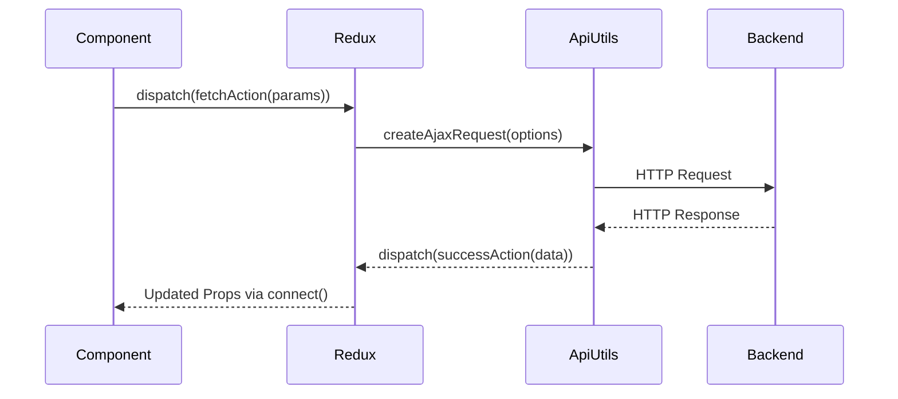
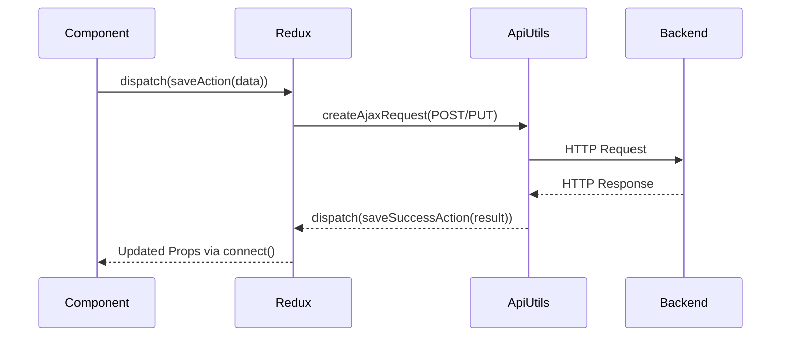

# API Interaction

This document describes how the frontend interacts with the backend API in Readarr, detailing the API communication patterns, service layer structure, and data exchange formats.

## API Communication Overview

Readarr's frontend communicates with its backend through a RESTful API. The communication layer is built on top of jQuery's AJAX functionality, with custom wrappers and utilities to standardize request handling, error management, and response processing.

## Core API Utilities

### `createAjaxRequest`

The fundamental building block for API communication is the `createAjaxRequest` utility:

```javascript
// from frontend/src/Utilities/createAjaxRequest.js
export default function createAjaxRequest(originalAjaxOptions) {
  const requestXHR = new window.XMLHttpRequest();
  let aborted = false;
  let complete = false;

  function abortRequest() {
    if (!complete) {
      aborted = true;
      requestXHR.abort();
    }
  }

  const ajaxOptions = { ...originalAjaxOptions };

  if (isRelative(ajaxOptions)) {
    addRootUrl(ajaxOptions);
    addApiKey(ajaxOptions);
    addContentType(ajaxOptions);
  }

  const request = $.ajax({
    xhr: () => requestXHR,
    ...ajaxOptions
  }).then(null, (xhr, textStatus, errorThrown) => {
    xhr.aborted = aborted;
    return $.Deferred().reject(xhr, textStatus, errorThrown).promise();
  }).always(() => {
    complete = true;
  });

  return {
    request,
    abortRequest
  };
}
```

This utility:
- Creates a cancelable AJAX request
- Automatically adds the API root URL to relative paths
- Includes the API key for authentication
- Sets appropriate content types
- Returns both the request promise and an abort function

### `ResourceApi`

A higher-level abstraction for resource-based API interactions exists in the `ConsoleApi` class:

```javascript
// Simplified from frontend/src/Diag/ConsoleApi.js
class ResourceApi {
  constructor(api, url) {
    this.api = api;
    this.url = url;
  }

  single(id) {
    return this.api.fetch(`${this.url}/${id}`);
  }

  all() {
    return this.api.fetch(this.url);
  }

  update(resource) {
    return this.api.fetch(`${this.url}/${resource.id}`, { 
      method: 'PUT', 
      data: resource 
    });
  }

  delete(resource) {
    if (typeof resource === 'object' && resource !== null && resource.id) {
      resource = resource.id;
    }
    
    return this.api.fetch(`${this.url}/${resource}`, { method: 'DELETE' });
  }

  fetch(url, options) {
    return this.api.fetch(`${this.url}${url}`, options);
  }
}
```

This class provides standardized methods for common RESTful operations like:
- Retrieving a single resource by ID
- Retrieving all resources of a type
- Updating a resource
- Deleting a resource

## Redux Integration

API calls are typically made through Redux thunks, which handle state updates based on API responses:

### `createFetchHandler`

A factory function that creates standardized API fetch handlers for Redux:

```javascript
// from frontend/src/Store/Actions/Creators/createFetchHandler.js
export default function createFetchHandler(section, url) {
  return function(getState, payload, dispatch) {
    dispatch(set({ section, isFetching: true }));

    const {
      id,
      ...otherPayload
    } = payload;

    const { request, abortRequest } = createAjaxRequest({
      url: id == null ? url : `${url}/${id}`,
      data: otherPayload,
      traditional: true
    });

    request.done((data) => {
      dispatch(batchActions([
        id == null ? update({ section, data }) : updateItem({ section, ...data }),

        set({
          section,
          isFetching: false,
          isPopulated: true,
          error: null
        })
      ]));
    });

    request.fail((xhr) => {
      dispatch(set({
        section,
        isFetching: false,
        isPopulated: false,
        error: xhr.aborted ? null : xhr
      }));
    });

    return abortRequest;
  };
}
```

This pattern:
- Sets loading state before the request
- Makes the API call
- Updates the Redux store with the response data
- Sets appropriate loading/error states
- Returns an abort function for request cancellation

## API Interaction Patterns

### Data Fetching



### Data Submission (Create/Update)



## Common API Endpoint Categories

### Resource Endpoints

Standard RESTful endpoints for core resources:

- `/author` - Author management
- `/book` - Book management
- `/bookshelf` - Bookshelf views
- `/profile` - Quality profiles
- `/metadata` - Metadata settings
- `/indexer` - Indexer configuration
- `/calendar` - Calendar data
- `/history` - History data
- `/queue` - Download queue

### Action Endpoints

Special endpoints for specific actions:

```javascript
// from frontend/src/Utilities/requestAction.js
function requestAction(payload) {
  const {
    provider,
    action,
    providerData,
    queryParams
  } = payload;

  const ajaxOptions = {
    url: `/${provider}/action/${action}`,
    contentType: 'application/json',
    method: 'POST',
    data: JSON.stringify(flattenProviderData(providerData))
  };

  if (queryParams) {
    ajaxOptions.url += `?${$.param(queryParams, true)}`;
  }

  return createAjaxRequest(ajaxOptions).request;
}
```

Examples include:
- `/command/action/downloadBook` - Trigger book download
- `/command/action/scanAuthor` - Scan author for new books
- `/command/action/refreshAuthor` - Refresh author metadata

## API Data Models

The frontend expects specific data structures from the API. Here are some key models:

### Author

```typescript
interface Author {
  id: number;
  name: string;
  sortName: string;
  status: string;
  overview: string;
  path: string;
  monitored: boolean;
  books: Book[];
  // Plus additional metadata fields
}
```

### Book

```typescript
interface Book {
  id: number;
  title: string;
  authorId: number;
  authorName: string;
  releaseDate: string;
  status: string;
  overview: string;
  monitored: boolean;
  editions: Edition[];
  // Plus additional metadata fields
}
```

### Quality Profile

```typescript
interface QualityProfile {
  id: number;
  name: string;
  items: {
    quality: {
      id: number;
      name: string;
    };
    allowed: boolean;
  }[];
  // Plus additional configuration
}
```

## Error Handling

API errors are typically processed in the Redux layer:

1. API responses with error status codes are converted to rejected promises
2. These are caught in the Redux thunk's `fail` handler
3. Error information is stored in the Redux state
4. Components render appropriate error messages based on the state

## API Authorization

- API requests include an API key for authentication
- The API key is automatically added to requests by the `createAjaxRequest` utility
- The key is stored in the `window.Readarr.apiKey` variable, populated during initial page load

## Best Practices

- Use the provided API utilities rather than direct AJAX calls
- Handle loading and error states in components
- Make API requests through Redux thunks for consistent state management
- Use cancelable requests for components that may unmount during a request
- Follow RESTful conventions for resource operations 