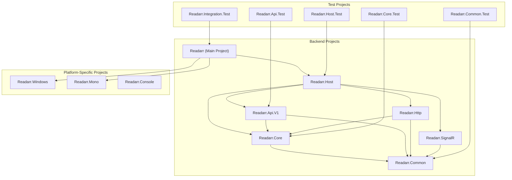
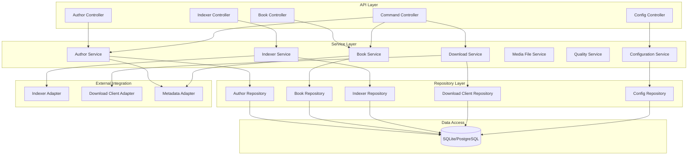

# Backend Microservice Overview

This document provides an overview of Readarr's backend architecture, describing the main components, their responsibilities, and interactions.

## Backend Architecture

Readarr is built using a modular .NET Core application architecture. While it's not strictly a microservices architecture in the traditional sense (with multiple independently deployable services), it follows a highly modular approach with clear separation of concerns between different components.

### Overview of Key Projects

## Project Responsibilities

### Core Projects

#### `Readarr.Core` (Domain Layer)
- Contains the core business logic and domain models
- Implements the key features of the application
- Manages data access through repositories
- Provides services for various aspects of the application
- Handles background jobs and scheduled tasks

Main components include:
- **Books**: Book and edition management services
- **Authors**: Author management services
- **MediaFiles**: File management for books
- **Indexers**: Integration with various indexers (Usenet, torrent sites)
- **Download**: Download client integration and management
- **Quality**: Quality definitions and profiles
- **Parser**: Media information parsing
- **Datastore**: Database access and management

#### `Readarr.Api.V1` (API Layer)
- Provides RESTful API endpoints for all application functionality
- Exposes resources and operations to the frontend
- Handles serialization/deserialization of API models
- Implements API-specific validation

#### `Readarr.Http` (HTTP Layer)
- Handles HTTP request processing
- Implements middleware for request/response pipeline
- Manages authentication and authorization
- Serves static frontend files

#### `Readarr.Common` (Shared Infrastructure)
- Cross-cutting concerns and utilities
- Filesystem access
- Logging and instrumentation
- Process management
- Configuration handling
- Extension methods
- Exception types

#### `Readarr.Host` (Application Host)
- ASP.NET Core application host
- Dependency injection configuration
- Middleware pipeline setup
- Application lifecycle management

#### `Readarr.SignalR` (Real-time Communication)
- Real-time updates to the UI
- WebSocket-based messaging
- Event broadcasting

### Platform-Specific Projects

#### `Readarr.Windows`
- Windows-specific implementation details
- System services integration
- Filesystem specifics

#### `Readarr.Mono`
- Mono/.NET Core runtime specific implementations
- Linux/macOS platform integration

#### `Readarr.Console`
- Console application entry point
- Command-line parsing and execution

## Component Diagram (C4 Model - Level 3)

## Key Components

### Controllers
Readarr's API controllers follow a RESTful design pattern, providing endpoints for specific resource types:

- **AuthorController**: Manages author resources
- **BookController**: Manages book resources
- **CalendarController**: Provides calendar-based views of books
- **CommandController**: Executes system commands
- **IndexerController**: Manages indexer configurations
- **DownloadClientController**: Manages download client configurations
- **HistoryController**: Access to historical events
- **QueueController**: Manages the download queue

### Services
The service layer contains the core business logic:

- **AuthorService**: Author management and metadata operations
- **BookService**: Book management and file operations
- **IndexerService**: Searching and monitoring indexers
- **DownloadService**: Managing downloads across clients
- **MediaFileService**: File operations for media files
- **QualityAnalysisService**: Analyzes file quality
- **ConfigService**: Application configuration

### Repositories
The repository layer provides data access abstractions:

- **AuthorRepository**: Author data access
- **BookRepository**: Book data access
- **EpisodeRepository**: Episode data access
- **IndexerRepository**: Indexer configuration access
- **DownloadClientRepository**: Download client configuration access

### Database
Readarr uses SQLite by default, with optional support for PostgreSQL:

- **Migration System**: Automatic database schema migrations
- **Custom Query Generation**: Optimized database queries
- **Repository Pattern**: Abstracted data access

### External Integration
Adapters for external service integration:

- **IndexerAdapter**: Connects to various indexer APIs
- **DownloadClientAdapter**: Interfaces with download clients
- **MetadataAdapter**: Retrieves metadata from external sources

## Communication Patterns

### Command Pattern
Commands are used for operations that modify the system state:
- **AuthorAddCommand**: Adds a new author
- **AuthorDeleteCommand**: Removes an author
- **BookSearchCommand**: Initiates a search for books
- **RssImportCommand**: Imports from RSS feeds

### Query Pattern
Queries retrieve data without modifying state:
- **GetAuthorsQuery**: Retrieves author information
- **GetBookFilesQuery**: Gets book file information

### Event System
Events are used for loose coupling between components:
- **AuthorAddedEvent**: Fired when an author is added
- **BookGrabbedEvent**: Fired when a book is grabbed from an indexer
- **BookImportedEvent**: Fired when a book is imported
- **DownloadCompletedEvent**: Fired when a download completes

The event system uses a publish-subscribe pattern, allowing components to react to system changes without tight coupling.

## Background Processing

Readarr uses a job scheduling system for recurring tasks:

- **RssSyncJob**: Periodically syncs with RSS feeds
- **BookSearchJob**: Searches for wanted books
- **ImportListSyncJob**: Syncs with external import lists
- **RefreshAuthorJob**: Updates author metadata
- **CleanupJob**: Performs system cleanup

Each job is scheduled with a specific interval and can be triggered manually through the API. 