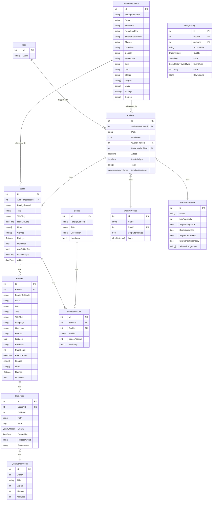

# Data Models and Database

This document details the data model structure and entity relationships in Readarr's database.

## Database Overview

Readarr uses SQLite by default for data storage, with optional support for PostgreSQL. The database schema is managed through a migration framework that incrementally updates the schema as new versions of the application are released.

## Entity Relationship Diagram

## Core Entities

### Author
Authors are central to Readarr's data model. An Author represents a writer whose work is being tracked. The Author entity is primarily for tracking and management purposes, while actual metadata about the author is stored in AuthorMetadata.

Key relationships:
- Links to AuthorMetadata for author details
- Has many Books
- Uses QualityProfile for determining acceptable file quality
- Uses MetadataProfile for determining metadata requirements
- Can have Tags

### AuthorMetadata
Contains the core metadata for an author, which can be shared across multiple Author entities.

Key attributes:
- Name, SortName
- Biography/Overview
- Gender, Hometown
- Birth/Death information
- Status (continuing, ended, etc.)
- Images, Links, Ratings, Genres

### Book
Represents a book title in the library. Books are associated with an author through the AuthorMetadata relationship.

Key relationships:
- Belongs to an AuthorMetadata
- Has many Editions
- Can be part of Series through SeriesBookLink

### Edition
Editions represent specific releases of a book. A Book can have multiple Editions (e.g., hardcover, paperback, ebook).

Key attributes:
- ISBN13, ASIN identifiers
- Language
- Format and IsEbook flag
- Publisher information
- Page count
- Release date

Key relationships:
- Belongs to a Book
- Has many BookFiles

### BookFile
Represents the actual files on disk for a specific Edition.

Key attributes:
- File path
- Size
- Quality information
- Date added
- Release group information

Key relationships:
- Belongs to an Edition

### Series
Represents a book series (e.g., "Harry Potter", "The Lord of the Rings").

Key attributes:
- Title
- Description
- Whether it's numbered

Key relationships:
- Connected to Books through SeriesBookLink

### SeriesBookLink
Junction table that connects Books to Series, storing the position of a book within a series.

Key attributes:
- Position (string position like "1.5" or "Book 2")
- SeriesPosition (integer position for sorting)
- IsPrimary (whether this is the main series for the book)

## Configuration Entities

### QualityProfile
Defines quality preferences for downloading/upgrading books.

Key attributes:
- Name
- Cutoff (minimum acceptable quality)
- Whether upgrades are allowed
- Items (list of quality options and their allowed status)

### MetadataProfile
Defines metadata requirements and filtering for importing books.

Key attributes:
- Name
- MinPopularity
- Whether to skip books missing date, ISBN, etc.
- Whether to skip parts/sets
- Allowed languages

### QualityDefinition
Defines quality types, their weights, and size constraints.

Key attributes:
- Quality ID
- Title
- Weight (for sorting quality levels)
- Min/Max Size limits

## Tracking Entities

### EntityHistory
Tracks events related to books such as downloads, imports, and deletions.

Key attributes:
- BookId and AuthorId
- SourceTitle (where the book came from)
- Quality
- Date
- EventType (Grabbed, BookFileImported, etc.)
- Additional Data dictionary

### Tag
Used for organizing and filtering authors.

Key attributes:
- Label

## Data Storage

### JSON Embedding
Readarr makes use of embedded JSON for complex data types:
- Images, Links, and Genres are stored as JSON arrays
- Ratings is stored as a JSON object
- Quality is stored as a JSON object with nested Revision
- Additional data in EntityHistory is stored as a JSON dictionary

### Lazy Loading
Entity relationships are loaded on-demand using LazyLoaded<T> wrappers to improve performance.

## Database Operations

### Repositories
The data access layer is implemented using the Repository pattern, with a BasicRepository<T> base class providing common operations.

Key repositories include:
- AuthorRepository
- BookRepository
- EditionRepository
- BookFileRepository
- SeriesRepository
- QualityProfileRepository

### ORM
Readarr uses a custom lightweight ORM with the following features:
- Table mapping through attributes and conventions
- Builder pattern for query construction
- Support for both SQLite and PostgreSQL

### Migrations
Database schema changes are managed through numbered migrations that are applied sequentially at application startup. Each migration contains the SQL statements needed to update the schema from one version to the next. 