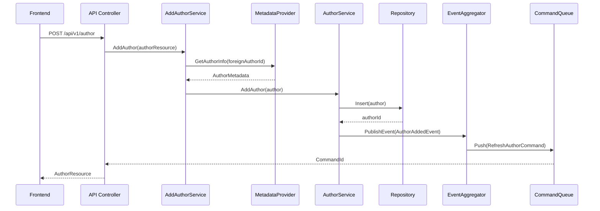
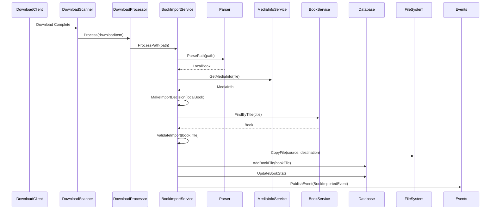
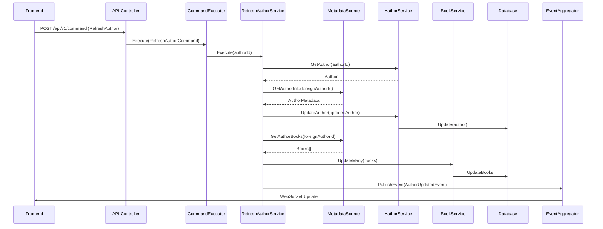
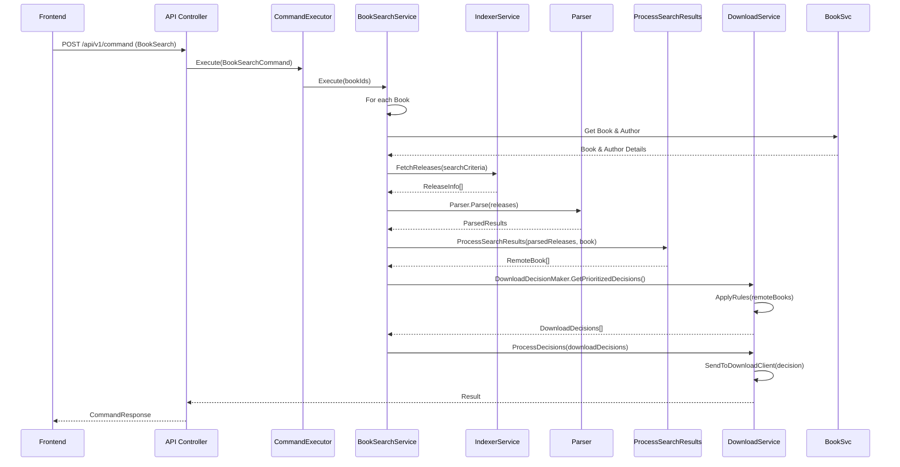
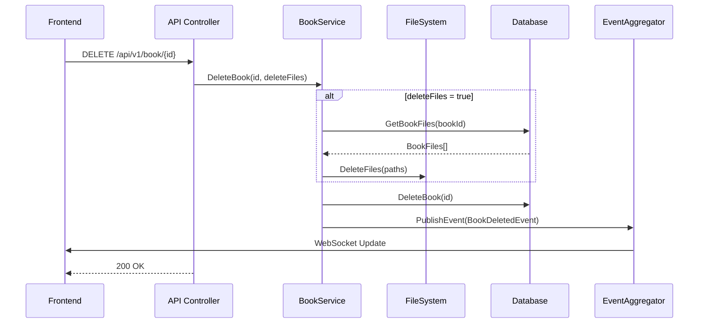

# Business Logic and Key Workflows

This document outlines the key business logic and workflows in Readarr, illustrating how components interact to perform important operations.

## Core Business Logic Components

Readarr's business logic is primarily implemented in services that coordinate operations across multiple domain entities. These services handle tasks such as:

- Author and book management
- Book file import and processing
- Metadata refresh and synchronization
- Search and download management
- File organization and renaming

## Key Workflows

### Author Addition Workflow



1. User submits a request to add a new author from the UI
2. API controller handles the request and passes it to the AddAuthorService
3. AddAuthorService retrieves metadata from the external metadata provider
4. Author entity is created and saved to the database
5. An AuthorAddedEvent is published
6. The event handler queues a RefreshAuthorCommand to fully populate the author's books
7. Response is returned to the UI with the new author information

### Book Import Workflow



1. Download client completes a book download
2. DownloadScanner detects the completed download
3. DownloadProcessor processes the download item
4. BookImportService is called to process the files
5. Parser extracts book information from the file path/name
6. MediaInfo is extracted from the file
7. Import decisions are made based on quality, format, etc.
8. Book is found in the database based on parsed information
9. File is validated against the book metadata
10. File is copied/moved to the appropriate location with proper naming
11. BookFile record is created in the database
12. Book statistics are updated
13. BookImportedEvent is published to trigger UI updates and post-import actions

### Metadata Refresh Workflow



1. User initiates a refresh for an author in the UI
2. API controller receives the command request
3. CommandExecutor processes the RefreshAuthorCommand
4. RefreshAuthorService retrieves the existing author from database
5. Fresh metadata is retrieved from the external metadata source
6. Author metadata is updated with the latest information
7. Books for the author are retrieved from the metadata source
8. Book database records are created/updated
9. AuthorUpdatedEvent is published to notify UI of changes
10. UI is updated via WebSocket with the refreshed information

### Book Search Workflow



1. User initiates a search for a book in the UI
2. API controller receives the search command request
3. BookSearchService executes the search logic
4. Book and author details are retrieved from the database
5. IndexerService searches configured indexers using search criteria
6. Parser processes the search results to extract release information
7. Results are processed and mapped to remote book entities
8. DownloadDecisionMaker applies rules to determine which releases to download
9. Selected release is sent to the configured download client
10. Result is returned to the UI

### Book Deletion Workflow



1. User requests to delete a book from the UI
2. API controller receives the delete request
3. BookService processes the deletion
4. If deleteFiles is true, associated files are removed from disk
5. Book record is removed from the database
6. BookDeletedEvent is published to notify UI of changes
7. UI is updated to remove the deleted book

## Event-Driven Architecture

Readarr uses an event-driven architecture to decouple components:

1. **Events**: Core domain events like AuthorAddedEvent, BookImportedEvent, etc.
2. **Event Handlers**: Components that react to events and perform follow-up actions
3. **Commands**: Requests for system actions like RefreshAuthorCommand, BookSearchCommand
4. **Command Handlers**: Components that process commands and orchestrate the execution

Example event handlers:

- **AuthorAddedHandler**: Queues a refresh for newly added authors
- **BookImportedHandler**: Updates stats and triggers notifications
- **AuthorDeletedHandler**: Cleans up related entities after author deletion

## Business Rules

### Book Monitoring Logic

Books are considered "monitored" based on several factors:
- Individual book monitoring flag
- Author monitoring flag
- Author's MonitorNewItems setting (All, None, or FirstBook)

### Quality and Upgrade Decisions

Files are selected for download based on:
- Quality Profile settings
- Current download status
- Whether upgrades are allowed
- Custom format scores

### Import Decision Logic

Import decisions consider:
- Parsed metadata match to existing books
- Quality requirements
- Duplicate detection
- Disk space availability
- File integrity

## Transaction Management

Readarr uses transactions for operations that modify multiple entities to ensure data consistency:

```csharp
// Example transaction pattern
using (var transaction = _database.OpenTransaction())
{
    try
    {
        // Perform multiple database operations
        _bookRepository.Update(book);
        _bookFileRepository.Insert(bookFile);
        _authorRepository.UpdateStats(author);
        
        transaction.Commit();
    }
    catch
    {
        transaction.Rollback();
        throw;
    }
}
```

This ensures that operations either complete fully or are rolled back entirely. 