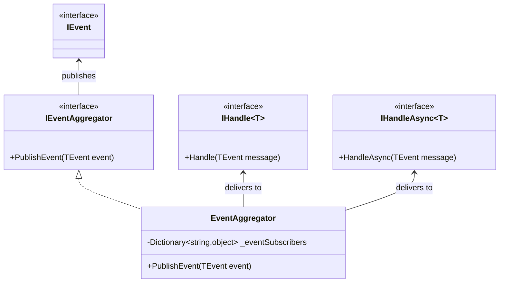
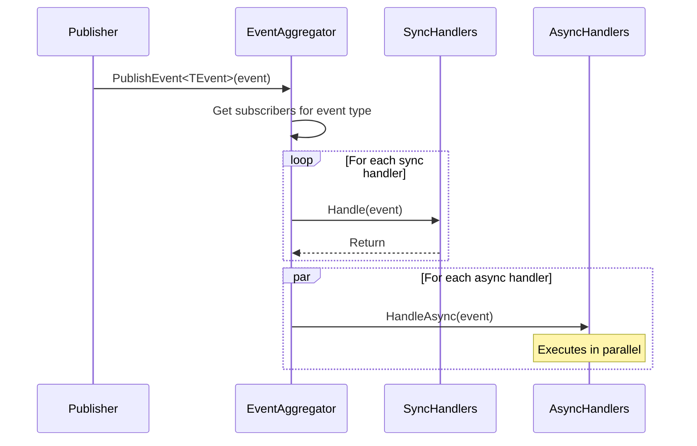
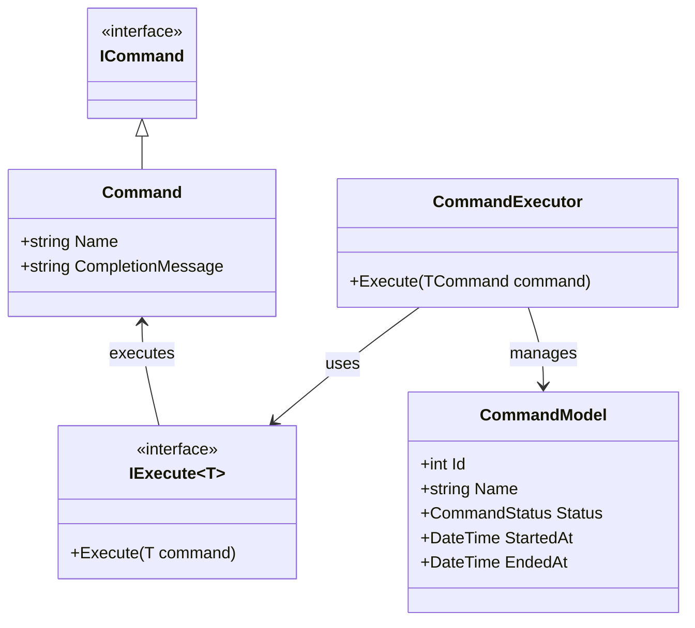
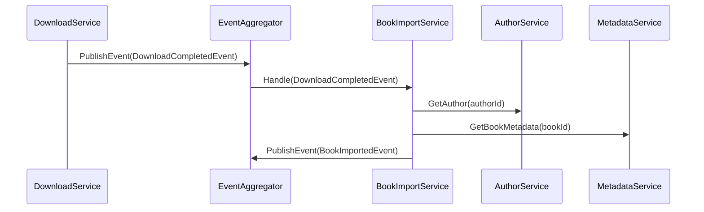
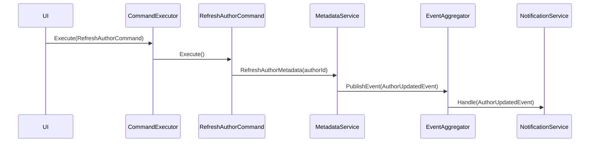

# Inter-Service Communication

This document describes how the different components and services within Readarr communicate with each other.

## Event-Driven Architecture

Readarr implements an event-driven architecture pattern using an internal event aggregator system. This allows for loose coupling between components and enables asynchronous processing of various operations.

### Event Aggregator

The core of Readarr's inter-service communication is the `EventAggregator` class, which acts as a central message bus for the application. It enables:

- Publishing events to multiple subscribers
- Both synchronous and asynchronous event handling
- Prioritization of event handlers

### Event Flow

When an event is published, the following sequence occurs:

1. The event is published to the `EventAggregator`
2. The `EventAggregator` identifies all subscribers for the event type
3. Synchronous handlers are executed first in order of priority
4. Asynchronous handlers are executed in parallel using a task factory

## Command Pattern

In addition to the event system, Readarr uses a command pattern for operations that require explicit execution, often triggered by user actions or scheduled tasks.

### Command Executor

The `CommandExecutor` class is responsible for:

- Executing commands
- Managing command state (queued, started, completed, failed)
- Broadcasting command status updates via the event system

### Command Queue Manager

The `CommandQueueManager` handles the lifecycle of commands:

- Queuing commands based on priority
- Tracking command execution status
- Handling command failures and retries

## Inter-Service Communication Flow Examples

### Book Import Process

### Metadata Refresh Process

## Benefits of This Architecture

1. **Loose Coupling**: Services don't need direct references to each other
2. **Scalability**: Asynchronous processing allows for better resource utilization
3. **Extensibility**: New event handlers can be added without modifying existing code
4. **Resilience**: Failures in one handler don't affect others
5. **Testability**: Components can be tested in isolation with mock events

## Limitations and Considerations

1. **Debugging Complexity**: Event-based systems can be harder to debug due to their asynchronous nature
2. **Eventual Consistency**: Data may not be immediately consistent across all services
3. **Ordering Guarantees**: Care must be taken to ensure proper ordering of events when required 