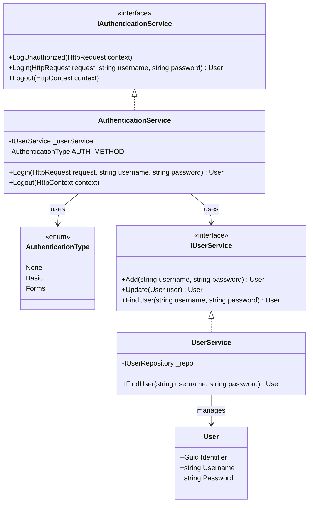
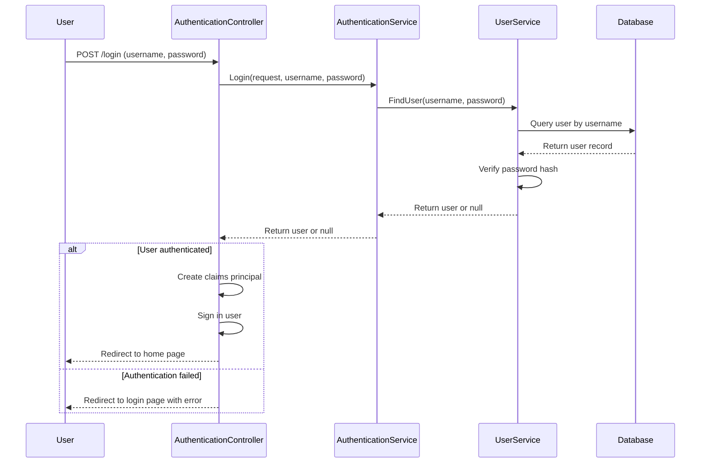
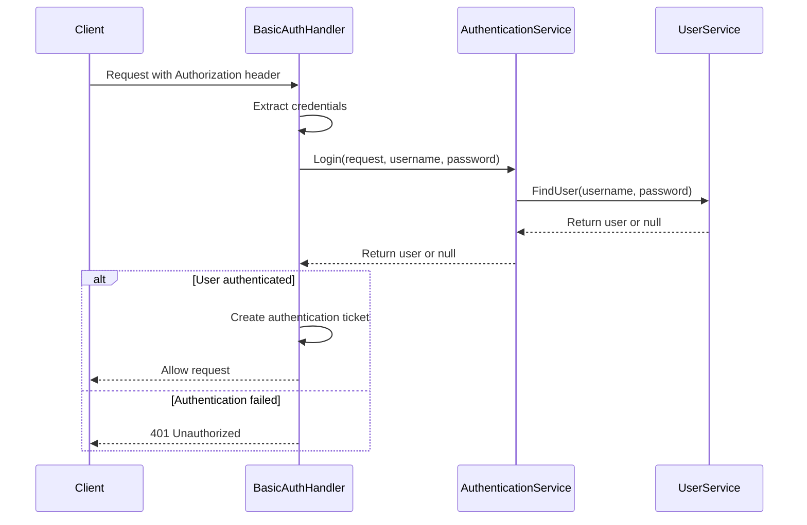
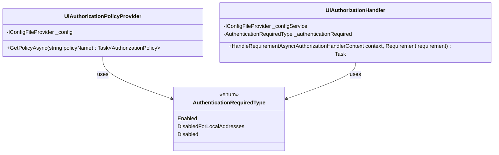
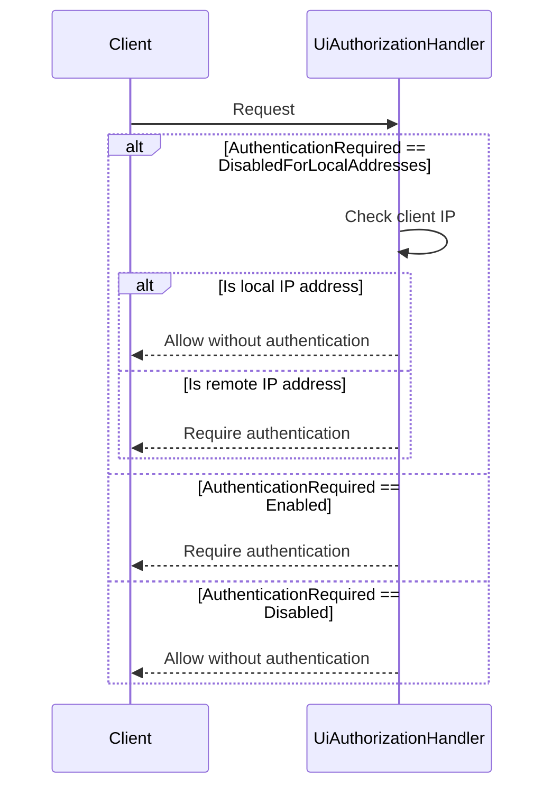

# Authentication and Authorization

This document describes the authentication and authorization mechanisms used in Readarr.

## Authentication Overview

Readarr supports multiple authentication methods to secure access to the application:

1. **Forms Authentication** - Username and password-based login
2. **Basic Authentication** - HTTP Basic Authentication for API access
3. **No Authentication** - Optional mode for private/secure environments

The authentication method is configurable through the application settings.



## Authentication Flow

### Forms Authentication Flow



### Basic Authentication Flow



## Password Security

User passwords are stored securely using SHA-256 hashing. The `UserService` handles password verification during login:

```csharp
// Password verification logic
if (user.Password == password.SHA256Hash())
{
    return user;
}
```

## Authorization

Readarr implements a flexible authorization system that can be configured based on the deployment environment.

### Authorization Policies

The application uses policy-based authorization with the following options:

1. **Always Required** - Authentication is always required
2. **Disabled for Local Addresses** - Local network requests bypass authentication
3. **Disabled** - Authentication is disabled completely (not recommended for public deployments)



### Local Network Detection

For the "Disabled for Local Addresses" option, Readarr checks if the request comes from a local IP address:



## API Authentication

API endpoints can be accessed using either:

1. API keys for automated tools and integrations
2. Basic authentication for user-based API access
3. Cookie-based authentication for browser sessions

## Security Considerations

1. **Default Configuration**: By default, authentication is enabled for all connections
2. **Local Network Trust**: The option to bypass authentication for local addresses assumes the local network is trusted
3. **HTTPS**: For production deployments, it's recommended to use HTTPS to encrypt credentials during transmission
4. **API Keys**: API keys should be treated as sensitive information and not shared publicly 