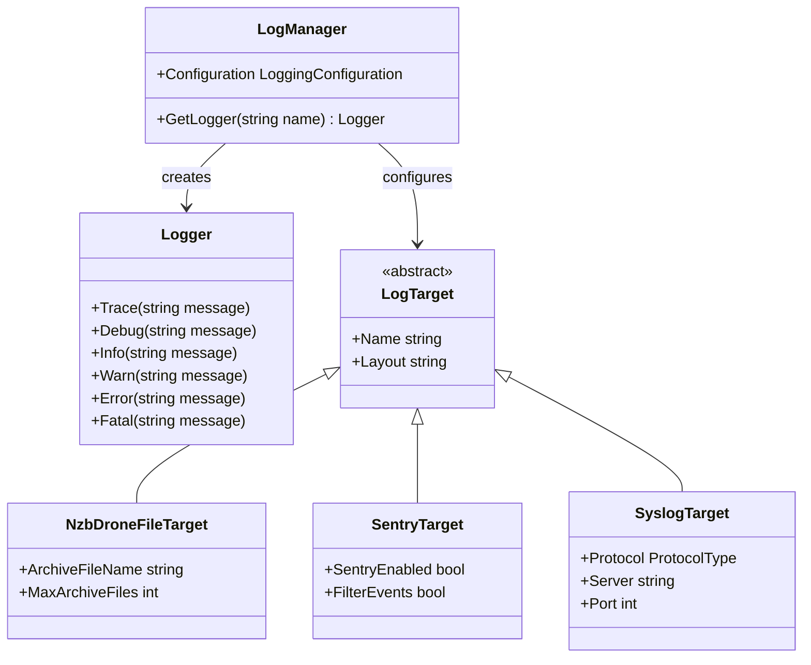
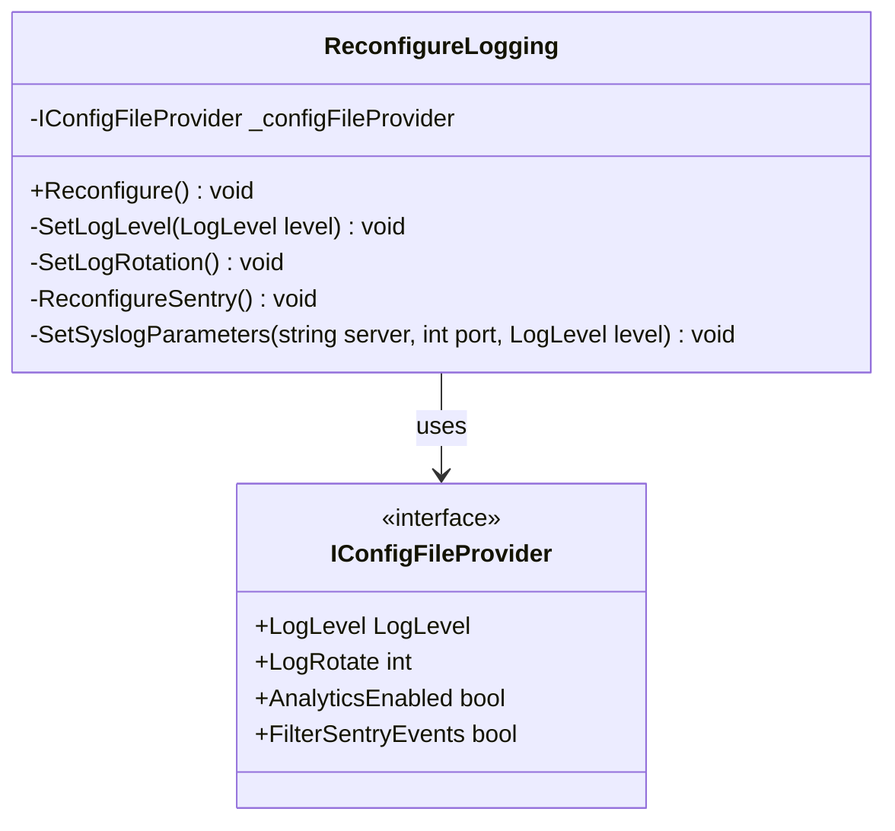
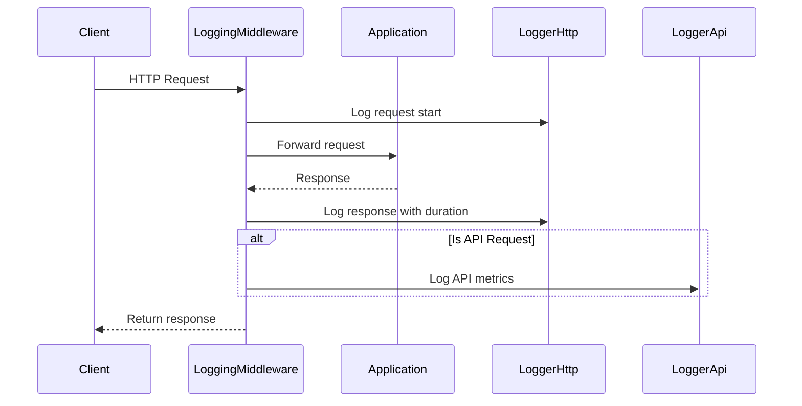
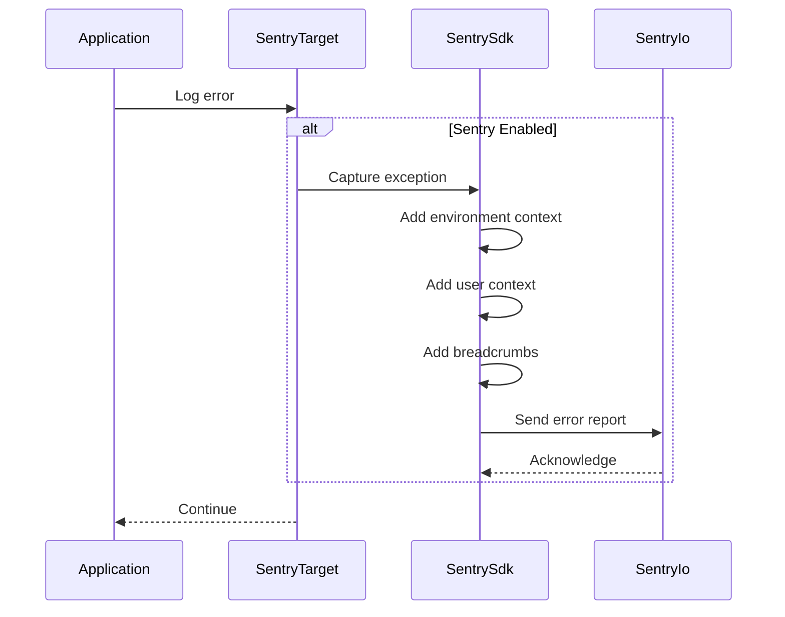
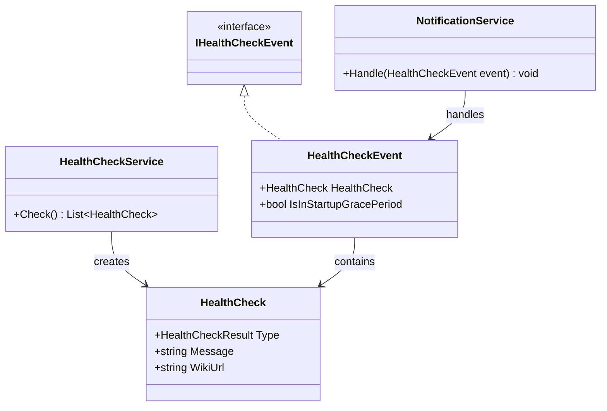

# Logging and Monitoring

This document describes the logging and monitoring mechanisms used in Readarr.

## Logging Architecture

Readarr uses NLog as its logging framework, providing flexible and configurable logging capabilities throughout the application.

### Log Levels

The application uses standard log levels to categorize log messages:

- **Trace** - Detailed debugging information
- **Debug** - Debugging information useful during development
- **Info** - General operational information
- **Warn** - Warning conditions that don't affect normal operation
- **Error** - Error conditions that may affect functionality
- **Fatal** - Critical errors that prevent the application from running

The minimum log level is configurable through application settings.

### Log Targets

Readarr supports multiple logging targets:

1. **File Logging** - Logs are written to files in the configured log directory
2. **Console Logging** - Logs are written to the console when running in console mode
3. **Syslog** - Optional logging to a syslog server
4. **Sentry** - Error reporting to Sentry.io for development and production monitoring

## Log Configuration

The `ReconfigureLogging` class is responsible for dynamically configuring the logging system based on application settings:

## Specialized Loggers

Readarr uses specialized loggers for different components of the application:

1. **Http Logger** - Logs HTTP requests and responses
2. **API Logger** - Logs API calls with performance metrics
3. **Auth Logger** - Logs authentication attempts and failures
4. **Command Logger** - Logs command execution

## HTTP Request Logging

The `LoggingMiddleware` captures HTTP request and response information:

## Log Rotation

Log files are automatically rotated to prevent excessive disk usage:

1. The maximum number of archive files is configurable
2. When the active log file reaches its size limit, it's archived and a new log file is created
3. When the maximum number of archive files is reached, the oldest archive is deleted

## Error Monitoring with Sentry

For development and production monitoring, Readarr integrates with Sentry.io:

1. Errors and exceptions are captured and sent to Sentry
2. Additional context is included such as:
   - Runtime environment information
   - Application version
   - Database version
   - User information (anonymized)

## Health Monitoring

Readarr includes an internal health monitoring system:

1. Health checks are performed periodically
2. Issues are reported through the UI and optionally via notifications
3. Health check categories include:
   - System resources (disk space, permissions)
   - External dependencies (download clients, indexers)
   - Configuration issues

## Download Client Monitoring

The `DownloadMonitoringService` monitors the status of download clients:

1. Periodically checks the status of configured download clients
2. Records success or failure of communication attempts
3. Tracks downloads and their progress
4. Reports failures through the health check system

## Performance Monitoring

Readarr includes performance monitoring for key operations:

1. API response times are logged
2. Command execution durations are tracked
3. Long-running operations are identified and logged

## Notification System

The notification system can alert users to important events:

1. Health check failures
2. Download failures
3. Import completions
4. Metadata updates

Notifications can be sent through various channels configured by the user (email, Slack, Discord, etc.). 