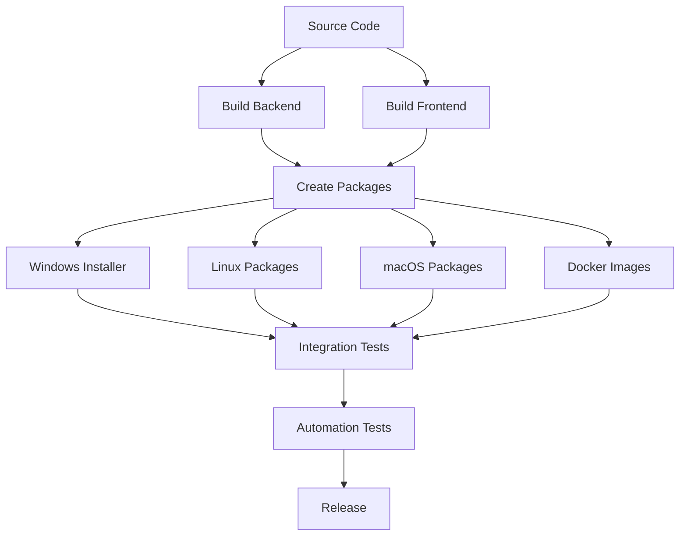
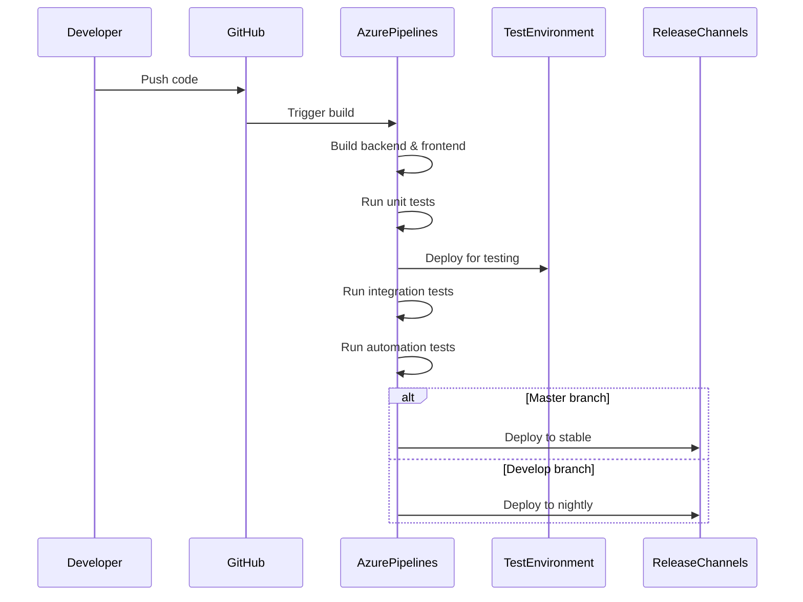
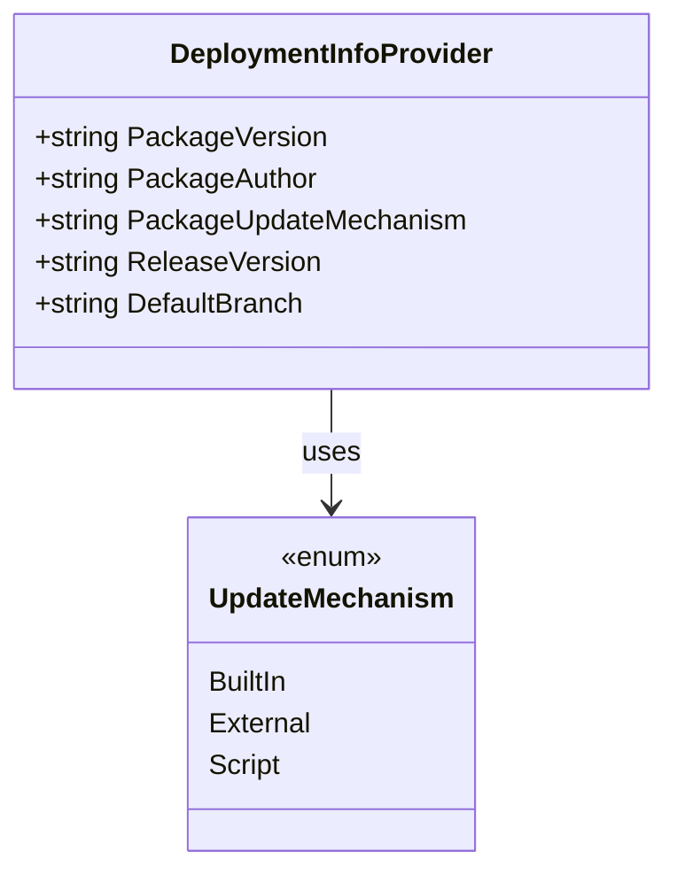
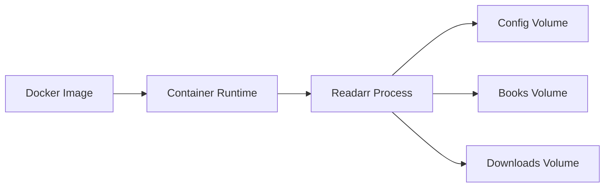

# Deployment and Infrastructure

This document describes the deployment process and infrastructure for the Readarr application.

## Deployment Options

Readarr supports multiple deployment options to accommodate different user environments:

1. **Windows Installation** - Native Windows installer (.exe)
2. **macOS Installation** - macOS package (.app)
3. **Linux Installation** - Various Linux packages (.deb, .rpm) and tarballs
4. **Docker Containers** - Official Docker images
5. **Manual Installation** - From source or pre-compiled binaries

## Build Pipeline

Readarr uses Azure Pipelines for continuous integration and deployment. The pipeline is defined in `azure-pipelines.yml` and consists of several stages:



### Build Stages

1. **Build Backend**
   - Compiles the .NET Core backend for multiple platforms (Windows, Linux, macOS)
   - Runs unit tests
   - Analyzes code quality

2. **Build Frontend**
   - Builds the React/JavaScript frontend
   - Bundles and optimizes assets

3. **Create Packages**
   - Combines backend and frontend artifacts
   - Creates platform-specific packages

4. **Windows Installer**
   - Builds Windows installers for x86 and x64 architectures

5. **Integration Tests**
   - Tests the built packages on different platforms
   - Verifies database compatibility (SQLite, PostgreSQL)

6. **Automation Tests**
   - Runs end-to-end tests to verify functionality

7. **Release**
   - Publishes artifacts to distribution channels

## Continuous Integration



## Release Channels

Readarr maintains multiple release channels:

1. **Stable** - Well-tested releases for general use
2. **Beta** - Pre-release versions for testing new features
3. **Nightly** - Daily builds from the development branch

## Deployment Information

The `DeploymentInfoProvider` class manages deployment-specific information:



## Update Mechanisms

Readarr supports different update mechanisms:

1. **Built-in** - The application handles its own updates
2. **External** - Updates are managed by an external system (package manager, Docker)
3. **Script** - Custom update scripts

## Docker Deployment

The official Docker images provide an easy way to deploy Readarr:



### Docker Compose Example

```yaml
version: '3'
services:
  readarr:
    image: linuxserver/readarr:latest
    container_name: readarr
    environment:
      - PUID=1000
      - PGID=1000
      - TZ=Europe/London
    volumes:
      - /path/to/config:/config
      - /path/to/books:/books
      - /path/to/downloads:/downloads
    ports:
      - 8787:8787
    restart: unless-stopped
```

## System Requirements

### Minimum Requirements

- **CPU**: Dual-core processor
- **RAM**: 2GB
- **Disk Space**: 1GB + space for books
- **Operating System**:
  - Windows 7 SP1 or later
  - macOS 10.12 or later
  - Any modern Linux distribution

### Recommended Requirements

- **CPU**: Quad-core processor
- **RAM**: 4GB
- **Disk Space**: 2GB + space for books
- **Database**: PostgreSQL for large libraries

## Deployment Best Practices

1. **Backup Configuration**
   - Regularly backup the configuration directory
   - Use volume mounts in Docker to persist data

2. **Database Considerations**
   - Use PostgreSQL for large libraries (>10,000 books)
   - Ensure regular database backups

3. **Security**
   - Run behind a reverse proxy with HTTPS
   - Use authentication
   - Limit external access to the API

4. **Performance**
   - Ensure adequate disk I/O for the database
   - Monitor memory usage for large libraries

## Monitoring and Health Checks

For production deployments, consider implementing:

1. **Container Health Checks** - For Docker deployments
2. **External Monitoring** - Using tools like Prometheus, Grafana
3. **Log Aggregation** - Centralized logging with ELK stack or similar

## Scaling Considerations

While Readarr is typically deployed as a single instance, for larger deployments consider:

1. **Database Scaling** - Move to external PostgreSQL
2. **Load Balancing** - For API-heavy workloads
3. **Resource Allocation** - Adjust container resources based on library size 